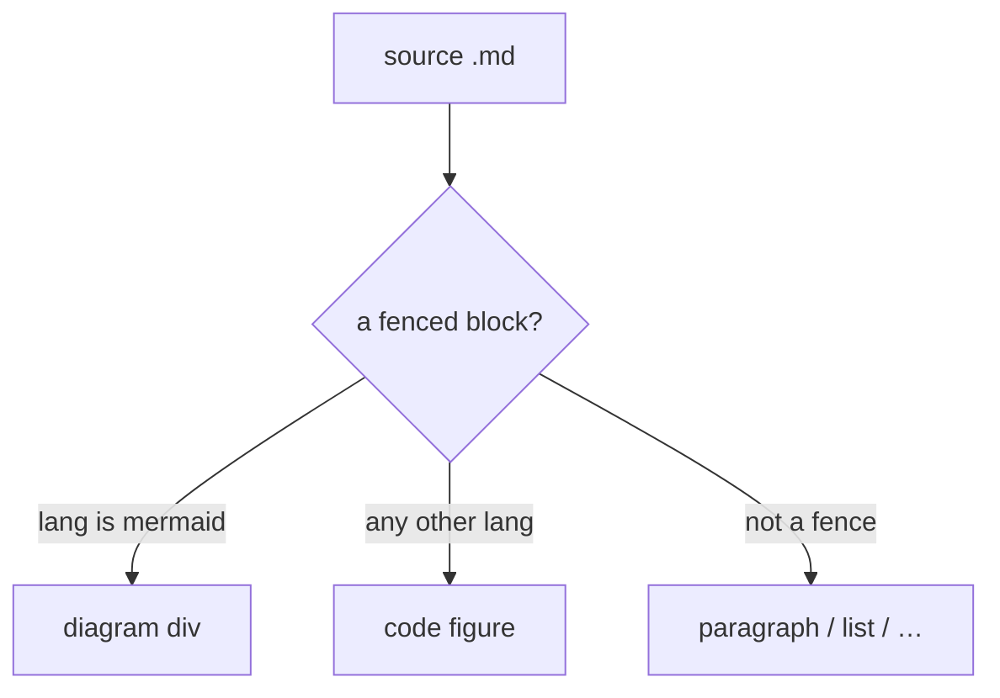

:::lead
still supports a small, deliberate subset of Markdown plus a handful of block
"containers" for the things plain Markdown can't express. This page documents
every construct — and is itself written in exactly what it describes.
:::

## Headings

`##` through `######` become `<h2>`…`<h6>`. (The page `<h1>` comes from the
`title`, so you start at `##`.) Each heading is auto-assigned a URL slug, and
hovering it reveals a `#` anchor link. To pin a specific anchor that other pages
link to, append `{#my-anchor}`:

```text ref="explicit anchor"
## Rendering pipeline {#pipeline}
```

## Inline formatting

Inside any paragraph: `**bold**`, `*italic*`, `` `inline code` ``, and
`[link text](target.html)`. Raw HTML entities (`&nbsp;`) and simple tags
(`<br/>`) pass straight through; a bare `&` is escaped for you.

The result: **bold**, *italic*, `code`, and a [link to the index](index.html).

## Lists

A `-` (or `*`) starts an unordered list; `1.` starts an ordered one. One level
deep — no nesting.

- first item
- second item, with `code` and **emphasis**
- third

1. ordered
2. also ordered

## Tables

GitHub-style pipe tables. A header row, a `---|---` separator, then body rows:

```text ref="a pipe table"
| Column | Meaning |
|---|---|
| `foo` | the first thing |
| `bar` | the second thing |
```

renders as:

| Column | Meaning |
|---|---|
| `foo` | the first thing |
| `bar` | the second thing |

## Code figures

A fenced block ```` ```lang ```` becomes a titled, syntax-highlighted figure
with a copy button. Highlighting is client-side and covers `cpp`, `slint`,
`glsl`, `bash`, and `text`. Add an optional `ref="…"` after the language for the
little source caption on the right (a `·` splits its bold head from the rest):

```bash ref="build.py · quickstart"
python3 build.py            # build everything
python3 build.py --watch    # rebuild on save
python3 build.py index      # just one page, by stem
```

The code lives inside a `<script type="text/plain">` tag in the HTML, so you
never hand-escape `<`, `>` or `&` in your samples.

## Mermaid diagrams

A ```` ```mermaid ```` block renders as a diagram. Mermaid is **vendored
locally** (`assets/mermaid.min.js`) and injected only on pages that use it, so
diagrams render offline and pages without them stay lean:



:::note No flash
The raw diagram source is hidden until Mermaid swaps in the finished SVG, so the
page never flickers the `flowchart …` text on load.
:::

## Callouts

Four coloured callouts. Write `:::name Optional Title`, the body, then a closing
`:::`. The body is full Markdown.

:::note A note
`:::note` — blue. For asides and clarifications.
:::

:::key A key point
`:::key` — teal. For the thing you most want remembered.
:::

:::warn A warning
`:::warn` — amber. For caveats and sharp edges.
:::

:::gotcha A gotcha
`:::gotcha` — red. For the mistake everyone makes once.
:::

## The lead paragraph

`:::lead … :::` renders the larger, dimmer intro paragraph at the top of a page
(this page opened with one). Use exactly one, right after the title.

## Cards

`:::cards` makes a navigation grid. Each line is
`- [Title](href) | kicker | description`:

:::cards
- [Configuration](config.html) | reference | The full `site.toml` schema.
- [Theming](theming.html) | reference | Recolour everything from a few tokens.
:::

## Steps

`:::steps` makes a numbered how-to. Each line is `- Heading | body paragraph`:

:::steps
- Write | Create a Markdown file under `content/`.
- Register | Add one line to `site.toml`.
- Build | Run `python3 build.py` and open the result.
:::

## Legend

`:::legend` makes a row of colour-dot chips. Each line is `- key: text`, where
`key` selects the dot colour (`audio`, `ui`, `gpu`):

:::legend
- ui: teal dot — one meaning
- audio: amber dot — another
- gpu: purple dot — a third
:::

## ASCII diagrams

`:::diagram` keeps its inner lines **verbatim** — whitespace preserved, raw HTML
allowed (handy for hand-drawn box diagrams with coloured `<span>`s):

:::diagram
  content/*.md ──▶ build.py ──▶ site/*.html
                     ▲
                 site.toml
:::

That is the entire dialect. If you need something it can't express, the source
in `build.py` is short enough to extend in an afternoon.
