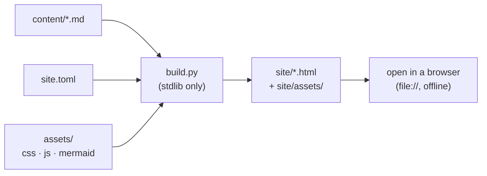

:::lead
**still** is a tiny static documentation generator. You write Markdown, run one
Python script with no dependencies, and get a folder of HTML you open by
double-clicking. No server, no `npm install`, no build toolchain — and it works
offline, over `file://`, forever.
:::

It was extracted from a real project's engineering docs, where the whole point
was being able to *read the docs while offline on a plane* without spinning up a
local server first. That constraint shapes every design decision here.

## Why it exists

Most "modern" doc tools quietly assume a server. The moment you open their
output as a local file, something breaks — because the browser blocks the very
things they rely on:

| Approach | Breaks over `file://` because… |
|---|---|
| Render Markdown in the browser (docsify-style) | `fetch()` of local `.md` is blocked by CORS |
| ES-module JavaScript | modules are blocked over `file://` in Chrome |
| Service-worker "offline" PWA | service workers need a secure context (https) |
| Single-page-app routing | needs a server to rewrite URLs |

still sidesteps all of it by **pre-rendering everything to plain HTML** at build
time, linking pages with ordinary relative links, and shipping a single classic
`<script>` for the interactive bits. That is the *only* stack that survives a
double-click.

:::key The one promise
Clone the repo, run `python3 build.py`, open `site/index.html`. That is the
entire workflow, and it never needs a network again.
:::

## What you get

:::cards
- [Writing pages](writing.html) | 01 · start here | Front matter, adding a page, the nav — the day-to-day loop.
- [Markdown dialect](dialect.html) | 02 · reference | Every block and inline construct, with live examples.
- [Configuration](config.html) | 03 · reference | The `site.toml` schema — name, nav, output, theme.
- [Theming](theming.html) | 04 · reference | Recolour the whole site from a handful of tokens.
:::

## How a build flows

Everything runs at build time. The browser only ever sees finished HTML:

The `assets/` folder is copied into the output verbatim, so the `site/` folder
is fully self-contained — zip it, email it, drop it on any static host, and it
just works.

## Requirements

:::legend
- ui: Python 3.11+ (for the stdlib `tomllib` TOML parser)
- gpu: a web browser — any modern one
- audio: nothing else. No pip installs, ever.
:::

That is the whole dependency list. The engine is a single ~450-line
`build.py`; if you can read it, you can change it.
